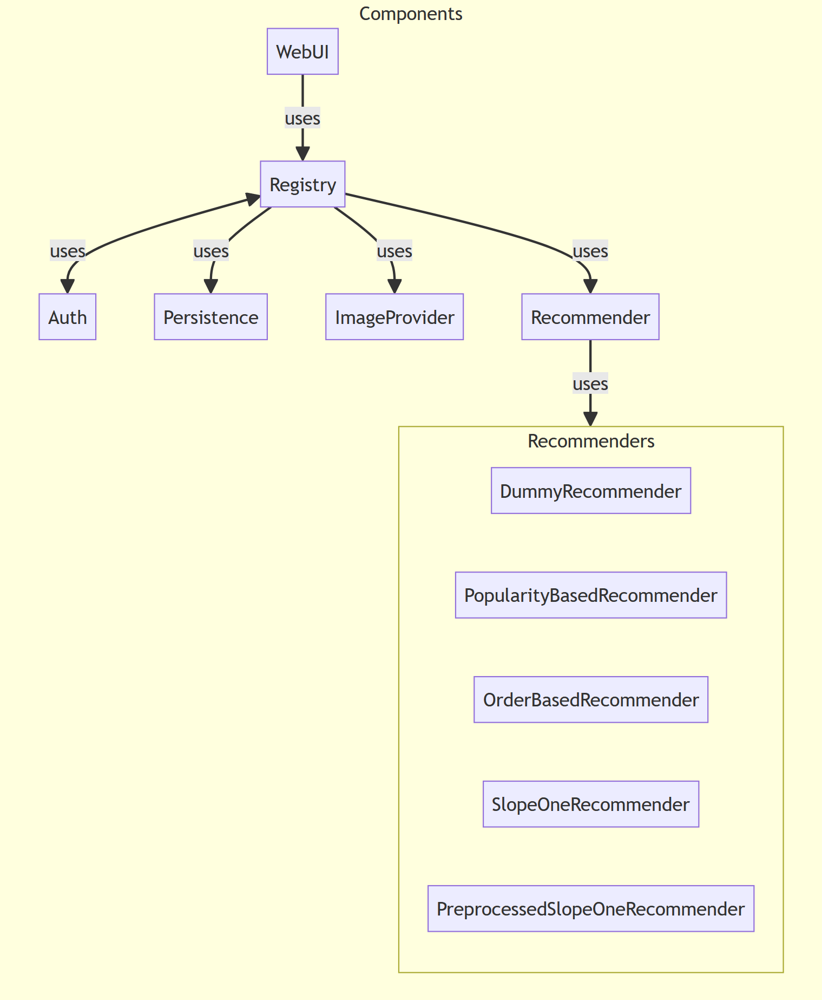

[](https://doi.org/10.5281/zenodo.10411853)

# Replication Package For Recovering Trace Links Between Software Documentation And Code
by Jan Keim, Sophie Corallo, Dominik Fuchß, Tobias Hey, Tobias Telge, and Anne Koziolek


## Abstract

*Introduction* 
Software development involves creating various artifacts at different levels of abstraction and establishing relationships between them is essential. 
Traceability link recovery (TLR) automates this process, enhancing software quality by aiding tasks like maintenance and evolution. 
However, automating TLR is challenging due to semantic gaps resulting from different levels of abstraction.
While automated TLR approaches exist for requirements and code, architecture documentation lacks tailored solutions, hindering the preservation of architecture knowledge and design decisions.

*Methods* 
In our paper, we present our approach TransArC for TLR between architecture documentation and code, using component-based architecture models as intermediate artifacts to bridge the semantic gap. 
We create transitive trace links by combining the existing approach ArDoCo for linking architecture documentation to models with our novel approach ArCoTL for linking architecture models to code.

*Results* 
We evaluate our approaches with five open-source projects, comparing our results to baseline approaches. 
The model-to-code TLR approach achieves an average F1-score of 0.98, while the documentation-to-code TLR approach achieves a promising average F1-score of 0.82, significantly outperforming baselines.

*Replication*
This replication package includes all used datasets, benchmarks, baselines, and approaches.
The package allows to reproduce the evaluation results, as well as to apply TransArC to other projects.


## Content 

This replication package belongs to **Recovering Trace Links Between Software Documentation And Code** by Keim et al. ([Preprint at DOI 10.5445/IR/1000165692](https://doi.org/10.5445/IR/1000165692/pre)).

This replication package allows to:

* get additional details to the publication (pseudocode for the computation of trace links between SAM and Code)
* reproduce the complete evaluation results of "Recovering Trace Links Between Software Documentation And Code"
* reuse TransArC (ArDoCo+ArCoTL) on other projects 

Therefore, we apply for both badges, availability and reusability:

**Availability**:  The replication package is placed on [Zenodo](https://zenodo.org/doi/10.5281/zenodo.10411853) with a [DOI (10.5281/zenodo.10411853)](https://doi.org/10.5281/zenodo.10411853) and is publicly available on [GitHub](https://github.com/ArDoCo/Replication-Package-ICSE24_Recovering-Trace-Links-Between-Software-Documentation-And-Code).

**Reusability**: The replication package includes a Docker image to reproduce the complete evaluation results, including all baselines. 
It further provides an extensive documentation and data to rebuild the Docker image or execute it locally. 
Finally, the replication package also allows the reuse of TransArC on other projects. 
Therefore, the package also includes the documentation of the TransArC CLI.

The replication package is structured as follows: 

* ardoco+arcotl: contains the source code of ArCoTL and ArDoCo
* baselines: contains the baselines used in the paper
* data: contains the data used in the paper, including the textual software architecture documentation, the architecture models and the gold standards.
* evaluator: contains helper scripts to evaluate the generated results
* results: contains the results of the experiments

Please be aware that the replication package is extensive and requires ~50GB storage.

This documentation is structured as follows:

* exemplary workflow of TransArC
* reproduction of complete evaluation results: setup and usage via provided Docker image, built Docker image, and local run
* reusing TransArC: setup and usage via CLI


## How TransArC Works

TransArC is an approach described in [Recovering Trace Links Between Software Documentation And Code](https://publikationen.bibliothek.kit.edu/1000165692) by Keim et al. ([DOI 10.5445/IR/1000165692](https://doi.org/10.5445/IR/1000165692)).
TransArC combines two approaches: ArDoCo for linking architecture documentation to models and ArCoTL for linking architecture models to code.
Thereby, TransArC bridges the gap between architecture documentation and code.

This section illustrates an exemplary task of recovering trace links between Software Architecture Documentation (SAD) and code for the TeaStore project.

### Artifacts
1. The source code of TeaStore is located here: [ardoco+arcotl/tests/tests-base/src/main/resources/benchmark/teastore/model_2022/code](ardoco+arcotl/tests/tests-base/src/main/resources/benchmark/teastore/model_2022/code). You can either use the code as described in the directory or you can use the acm file (JSON representation of code elements).
2. The architecture model (SAM) of TeaStore can be found here: [ardoco+arcotl/tests/tests-base/src/main/resources/benchmark/teastore/model_2020/uml](ardoco+arcotl/tests/tests-base/src/main/resources/benchmark/teastore/model_2020/uml). In this directory, you can find the UML component model (teastore.uml) that contains the components and interfaces of the system (XML representation).
3. Finally, you can find the textual software architecture documentation (SAD) of TeaStore here: [ardoco+arcotl/tests/tests-base/src/main/resources/benchmark/teastore/text_2020/teastore.txt](ardoco+arcotl/tests/tests-base/src/main/resources/benchmark/teastore/text_2020/teastore.txt). The documentation is provided in the form of a single text file.

#### Components of TeaStore
The following diagram depicts an overview of the components of TeaStore.
For readability, we group all recommenders into a common box.
In the model, the recommender component uses all recommenders via a strategy interface.


### Linking SAD to Code
We aim to recover trace links between the code and the documentation of TeaStore.
The trace links that shall be recovered are provided as ground truth in the following file:
[ardoco+arcotl/tests/tests-base/src/main/resources/benchmark/teastore/text_2020/goldstandard_code_2022.csv](ardoco+arcotl/tests/tests-base/src/main/resources/benchmark/teastore/text_2020/goldstandard_code_2022.csv)

This file contains a mapping between the sentences of the documentation and the code elements that shall be linked to the respective sentence.

If we consider the first two sentences of the documentation ...
```text
The TeaStore consists of 5 replicatable services and a single Registry instance.
The WebUI service retrieves images from the Image Provider.
```

We should find the following trace links:
```csv
sentenceID,codeID
1,services/tools.descartes.teastore.registry/src/main/java/tools/descartes/teastore/registry/
2,services/tools.descartes.teastore.image/src/main/java/tools/descartes/teastore/image/
2,services/tools.descartes.teastore.webui/src/main/java/tools/descartes/teastore/webui/
2,tools/test_webui.sh
...
```

### Linking SAM to Code
We use trace links between SAM and code as an intermediate step for recovering trace links between documentation and code.
The SAM contains multiple components and interfaces.
For TeaStore we have the following components with their resp. IDs:
```text
* WebUI (_bC13QDVWEeqPG_FgW3bi6Q)
* Registy (_dhM6oDVXEeqPG_FgW3bi6Q)
* Persistence (_lnx1oDVWEeqPG_FgW3bi6Q)
* Recommender (_m3fxEDVWEeqPG_FgW3bi6Q)
* Auth (_AiuxcDVdEeqPG_FgW3bi6Q)
...
```

Our approach recovers trace links between the code and the SAM.
The trace links that shall be recovered are provided as ground truth in the following file: [ardoco+arcotl/tests/tests-base/src/main/resources/benchmark/teastore/model_2022/goldstandard_sam_2020-code.csv](ardoco+arcotl/tests/tests-base/src/main/resources/benchmark/teastore/model_2022/goldstandard_sam_2020-code.csv)

We connect the code elements (ce_ids) to the architecture model elements (ae_id).
For convenience, we also provide the name of the architecture model element (ae_name).
We expect our approach to find trace links like the following:

```csv
ae_id,ae_name,ce_ids
_AiuxcDVdEeqPG_FgW3bi6Q,Component: Auth,services/tools.descartes.teastore.auth/src/main/java/tools/descartes/teastore/auth/
_BYKdQDVgEeqPG_FgW3bi6Q,Interface: RecommenderStrategy,services/tools.descartes.teastore.recommender/src/main/java/tools/descartes/teastore/recommender/algorithm/IRecommender.java
...
```

## Reproduction of Complete Evaluation Results

Please be aware that the reproduction of the complete evaluation results can take some time.
On our system (Tesla V100S, 32GB VRAM, 256GB RAM, 112 CPUs a 2.7Ghz), the execution takes approximately: 

* CodeBERT: 4h
* FTLR: 20 min
* TAROT: 10 min
* TransArC: 7 min 

Everything was tested on Linux.

### Hardware Requirements
We recommend the execution on a system with at least **16 GB RAM**. 
To execute the baseline ***CodeBERT***, the system also needs GPU support and a **GPU with CUDA 12.2 and ~16GB vRAM**.

### Setup

The evaluation results can be created in three ways: 

* Use the provided Docker image or
* Build the Docker image yourself or
* Generate the results locally by yourself.

#### Provided Docker Image
Use the provided Docker image and run: `docker run -it --rm --gpus all ghcr.io/ardoco/icse24`.

If you do not have GPUs and/or want to run the image withouth GPU support, run:  `docker run -it --rm ghcr.io/ardoco/icse24`.

#### Build Docker Image
Build Docker image by command: `docker build -t icse24 .` <br>
Run the Docker image with: `docker run -it --rm --gpus all icse24` (with GPU support) or `docker run -it --rm ghcr.io/ardoco/icse24` (without GPUs).

#### Run Locally
Requirements:

* Java JDK 17 + Maven 3 (for ArDoCo+ArCoTL, TAROT)
* Python 3.9 (for FTLR)
* Python 3.7 (for CodeBERT)
* Git + LFS Support
* Internet (for CodeBERT)

##### CodeBERT

Go to the CodeBERT directory: `./baselines/CodeBERT`
Create a python environment:

```
python3.7 -m venv --copies venv
source venv/bin/activate
python3.7 -m pip install -r requirement.txt
```

Download our new CodeBERT model for Java: https://huggingface.co/kit-mcse/CodeBERT-Java

Copy and unzip the downloaded model folder to `../models/codeBert`

Execute CodeBERT: `bash execute_baseline_codebert.sh`

The output should look like: 

```
INFO:__main__:model loaded
INFO:__main__:Creating examples from dataset file at ../../data/MediaStore/test
retrieval evaluation: 100%|████████████████| 359/359 [10:04<00:00,  1.68s/it]

pk3=0.243, pk2=0.189,pk1=0.135, precision=0.286 recall=0.12 best_f1 = 0.169, best_f2=0.219, MAP=0.18, MRR=0.23750049591362857, exe_time=604.0603840351105,f1_threshold=0.9998379945755005

(venv) root@475915bc3e53:/replication/baselines/CodeBERT/trace/trace_single#
```


##### FTLR

Go to the FTLR directory: `./baselines/finegrained-traceability` <br>
Create a python environment:

```
python3.9 -m venv --copies venv
source venv/bin/activate
python3.9 -m pip install fasttext~=0.9.2 javalang~=0.13.0 pycparser~=2.21 comment-parser~=1.2.4 esprima~=4.0.1 XlsxWriter~=3.0.1 spacy~=3.1.1 pydantic~=1.8.2 typing-extensions~=4.2.0 nltk~=3.2.5 numpy~=1.22.3 scikit-learn~=1.1.1 pandas~=1.1.5 joblib~=1.1.0 autograd~=1.3 torch~=1.13.1 transformers~=4.26.1 scipy~=1.8.1 pyemd~=0.5.1 gensim~=3.6.0
python3.9 -m spacy download it_core_news_lg
python3.9 -m spacy download en_core_web_lg
python3.9 -m nltk.downloader stopwords
python3.9 -m nltk.downloader punkt
python3.9 -m nltk.downloader wordnet
```

Download fastText models from: 

* https://dl.fbaipublicfiles.com/fasttext/vectors-crawl/cc.en.300.bin.gz
* https://dl.fbaipublicfiles.com/fasttext/vectors-crawl/cc.it.300.bin.gz

Copy the downloaded models to `../models`<br>
Unzip models `gunzip cc.en.300.bin.gz && gunzip cc.it.300.bin.gz`


Download Source Code of Benchmarks: 

```
rm -r ./datasets/bigbluebutton/code && \
git clone https://github.com/ArDoCo/bigbluebutton.git ./datasets/bigbluebutton/code && \
rm -r ./datasets/bigbluebutton/code/.git && \
rm -r ./datasets/jabref/code && \
git clone https://github.com/ArDoCo/jabref.git ./datasets/jabref/code && \
rm -r ./datasets/jabref/code/.git && \
rm -r ./datasets/MediaStore/code && \
git clone https://github.com/ArDoCo/MediaStore3.git ./datasets/MediaStore/code && \
rm -r ./datasets/MediaStore/code/.git && \
rm -r ./datasets/teammates/code && \
git clone https://github.com/ArDoCo/teammates.git ./datasets/teammates/code && \
rm -r ./datasets/teammates/code/.git && \
rm -r ./datasets/TeaStore/code && \
git clone https://github.com/ArDoCo/TeaStore.git ./datasets/TeaStore/code && \
rm -r ./datasets/TeaStore/code/.git
```

Open `./App.py` and change the following lines to your location of the fastText models

```
ENGLISH_FASTTEXT_MODEL_PATH = "/replication/baselines/models/cc.en.300.bin"
ITALIAN_FASTTEXT_MODEL_PATH = "/replication/baselines/models/cc.it.300.bin"
```

To run FTLR execute: `bash execute_baseline_ftlr.sh`

Please be aware that the output of FTLR is very verbose.
Warnings like `ERROR:preprocessing.JavaLangUtil:Unknown case: [MemberReference(member=sessionBean, ...` can be ignored.

The output is written to: ` ./datasets/<ProjectName>/output` <br>
It should look like: 
```
(venv) root@5aab73915535:/replication/baselines/finegrained-traceability/datasets/MediaStore/output# ll
total 88
drwxr-xr-x 2 root root  4096 Dec 19 13:18 ./
drwxr-xr-x 1 root root  4096 Dec 19 13:18 ../
-rw-r--r-- 1 root root 13786 Dec 19 13:12 MediaStore_FTLRMc_tracelinks.csv
```


##### TAROT

Go to the TAROT directory: `./baselines/TAROT` <br>
Execute the bash script: `bash execute_baseline_tarot.sh`

Please be aware that the output of TAROT is very verbose.

The results look like:

```
INFO edu.kit.kastel.mcse.ardoco.evaluator.cli.EvaluatorCli - 0.06;0.20;0.09;0.94;0.95;0.08
Running evaluator for MediaStore_IR-ONLY_TAROT_VSM_0.97.csv
```


##### TransArC (ArDoCo+ArCoTL)

TransArC can be executed via Maven or its CLI. 

###### Maven

The execution of the ArDoCo+ArCoTL (TransArC) experiments is encapsulated in a JUnit test suite: [TraceLinkEvaluationIT](ardoco+arcotl/tests/tests-tlr/src/test/java/edu/kit/kastel/mcse/ardoco/core/tests/integration/TraceLinkEvaluationIT.java).

In order to run the experiments, please execute the following command within the ardoco+arcotl folder: <br> 
`mvn -q -P tlr clean test -Dsurefire.failIfNoSpecifiedTests=false -Dtest=TraceLinkEvaluationIT`

You can also run `mvn -P tlr clean test -Dsurefire.failIfNoSpecifiedTests=false -Dtest=TraceLinkEvaluationIT` to produce more verbose output of maven.

The results are printed in a format like this:

```
TEASTORE (SadSamCodeTraceabilityLinkRecoveryEvaluation):
        Precision:    1.00 (min. expected: 1.00)
        Recall:       0.71 (min. expected: 0.71)
        F1:           0.83 (min. expected: 0.83)
        Accuracy:     0.98 (min. expected: 0.98)
        Specificity:  1.00 (min. expected: 1.00)
        Phi Coef.:    0.83 (min. expected: 0.83)

```

Please note that the `min. expected` values refer to thresholds that are used to determine whether the test shall fail because of some unexpected degradation of the results.

* `SadSamCodeTraceabilityLinkRecoveryEvaluation`: evaluation of the transitive trace links between SAD and code (via SAM).
* `SamCodeTraceabilityLinkRecoveryEvaluation`: evaluation of the trace links between SAM and code.
* `SadSamTraceabilityLinkRecoveryEvaluation`: evaluation of the trace links between SAD and SAM.


###### CLI

In the folder [ardoco+arcotl/cli](./ardoco+arcotl/cli), there is the source code for the CLI.
You can easily compile the CLI by using the command `mvn package` within the directory [ardoco+arcotl](./ardoco+arcotl). 
To speed up the build, you can skip tests using the following command: `mvn package -DskipTests -DskipITs`. 
The compiled CLI can then be found in the folder [ardoco+arcotl/cli/target/](./ardoco+arcotl/cli/target/) as `ardoco-cli.jar`.
Note: If you are using the provided Docker image, the CLI is already compiled and can be found at `/replication/ardoco+arcotl/ardoco-cli.jar`.

You can call the CLI to execute the evaluation with the following command, where OUT is the path to a folder where the output should be written to: <br>
`java -jar ardoco-cli.jar -e -o OUT`

This command executes TransArC on all benchmark projects and creates CSV files with the found trace links.
To evaluate the CSV-files against a goldstandard, you can use the provided evaluator in the [evaluator folder](./evaluator).
You can execute it like follows to get precision, recall, and F1 when comparing the results to a goldstandard: <br>
`java -jar evaluator.jar -t RESULT-FILE -g GOLDSTANDARD-FILE` <br>
In the evaluator-folder are also shell-scripts that automate this, given that the files are in the correct folders.


## Reusing TransArC

To reuse TransArC, you can use the provided CLI (see above). 
With the CLI, you can specify the task that you want to perform (i.e., SAD-Code, SAM-Code, or SAD-SAM) and provide the necessary input files along with an output directory, where the output files will be saved to. 
In the following, we show example commands to run the CLI. with `java -jar ardoco-cli.jar -h`, you can always find the help message.

In the following, we use placeholders as follows:

* `NAME` denotes the name of the project, e.g., `MediaStore`
* `DOCUMENTATION` is the path to the software architecture documentation file, usually a `.txt`
* `MODEL` is the path to the software architecture model file (`.uml` or `.pcm`)
* `OUT` is the path to a folder where the output should be written to.

To execute SAD-Code: <br> 
`java -jar ardoco-cli.jar -t SAD-Code -n NAME -d DOCUMENTATION -m MODEL -c CODE -o OUT`

To execute SAM-Code: <br> 
`java -jar ardoco-cli.jar -t SAM-Code -n NAME -m MODEL -c CODE -o OUT`

To execute SAD-SAM: <br> 
`java -jar ardoco-cli.jar -t SAD-SAM -n NAME -d DOCUMENTATION -m MODEL -o OUT`

The output files are CSV-files that contain the found trace links for each task. Depending on the current task, a CSV-file might be empty because the corresponding part was not executed (e.g., the SAD-Code part can be empty if only the SAM-Code part specfied as task).
To evaluate the CSV-files against a goldstandard, you can use the provided evaluator in the [evaluator folder](./evaluator).
You can execute it like follows to get precision, recall, and F1 when comparing the results to a goldstandard: <br>
`java -jar evaluator.jar -t RESULT-FILE -g GOLDSTANDARD-FILE`

